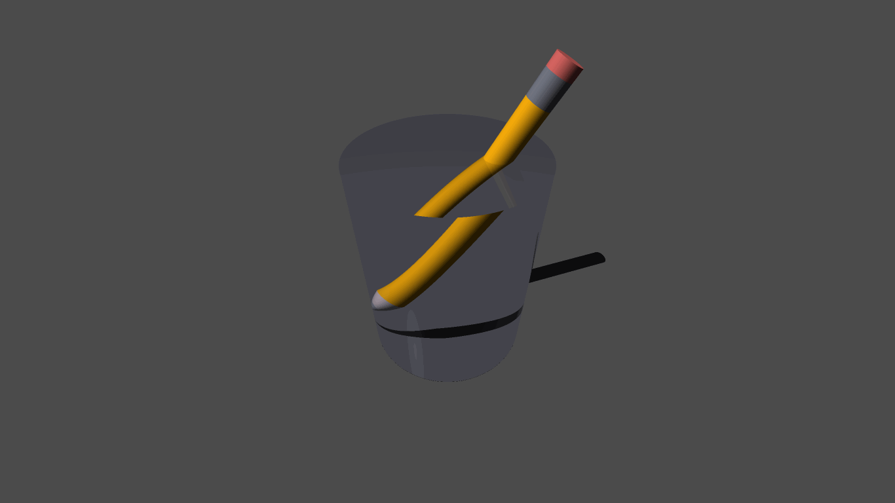

# RayTracer

## Features  
  
Ambient, diffuse, specular, reflective and refractive materials  
Grid supersampling anti-aliasing  
Animation generation  
Multithreading  
  
Possible future features:  
More UV mapping  
Input file parsing  
  
## Primitives  
  
Sphere  
Plane  
Triangle  
Disk  
Cone  
Cylinder  
Capsule  
AABB  
RoundedBox  
Ellipsoid  
Sphere4  
Infinite Cylinder - Normal calculation is incorrect 
Torus - Torus erronously casts shadows on itself   
    
## Example Output 
